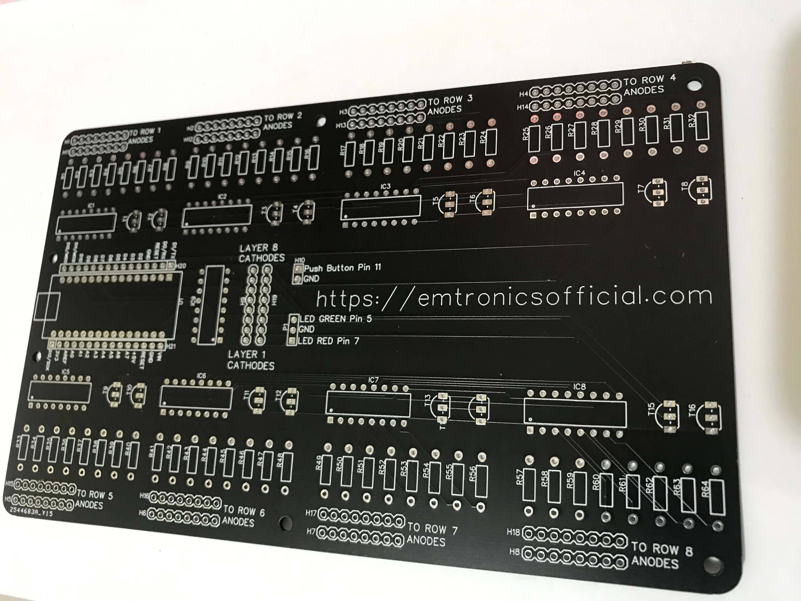
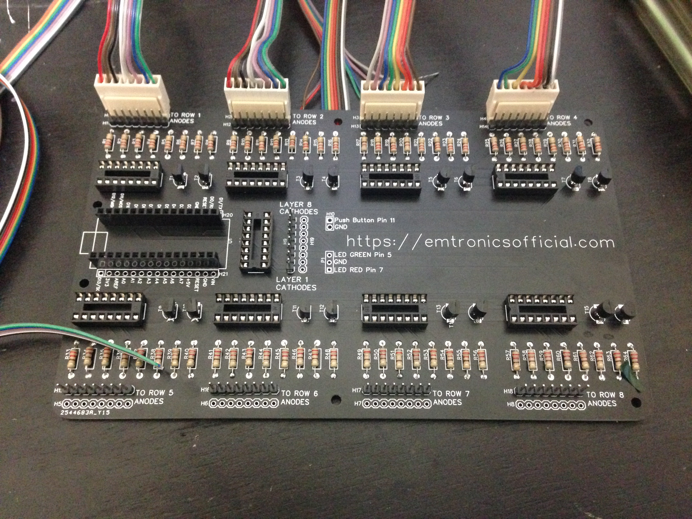
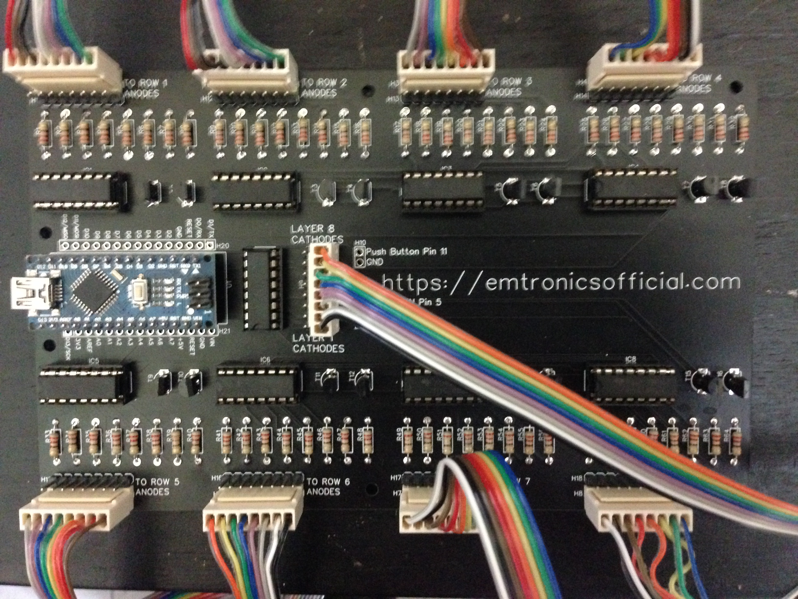
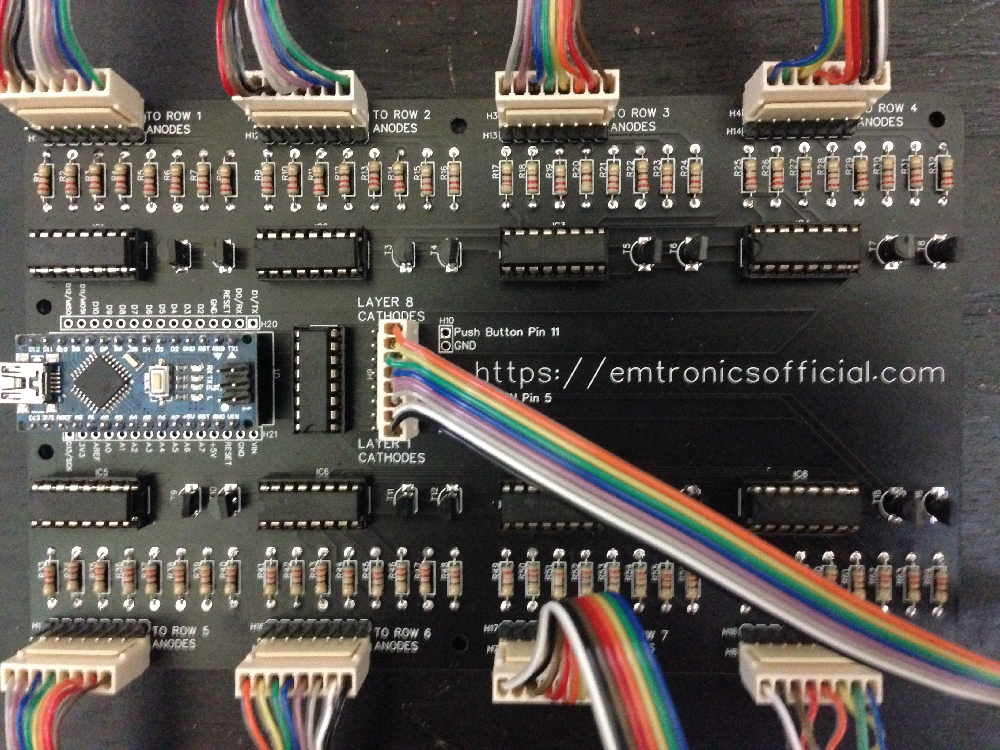
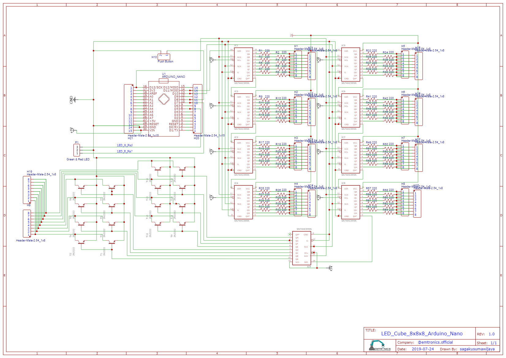

# LED-Cube-8x8x8

## You can see tutorial video in the link below :
* [Part1](https://www.youtube.com/watch?v=ky7VQFnBArA)
* [Part2](https://www.youtube.com/watch?v=yVZUEXGwSbg)

## Board
* You can download schematic [here](Schematic_LED_Cube_8x8x8_Nano_2020-05-19_12-22-00.pdf)
* The board looks like these pictures shown below :

## Schematic

## Code (will be updated)
